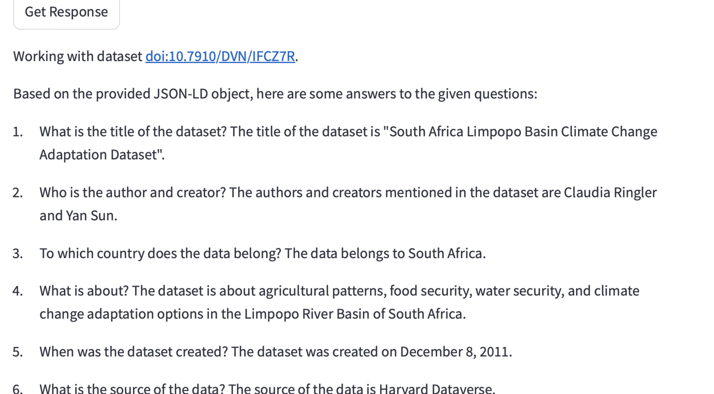

# DataChat - AI powered app for Dataverse and other data platforms
Experimental Graph AI implementation for Croissant ML support in Dataverse and SSHOC.nl 

Quick start:
```
cp env_sample .env
docker-compose up -d
```

For local deployment of llama3:
```
docker exec -it ollama /bin/bash
ollama pull llama3
```
Demo of the app below:



